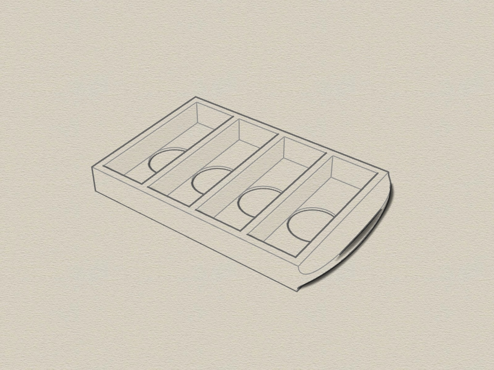

# EPROM 4x carrier unit

3D printable 4x carrier unit for Siemens UV erasure device  (Siemens UV-Löscheinheit 6ES5985-0AA11), created with Rhino6.
The Siemens UV erasure device has a flap where you can insert up to 4 Eprom chips. 
The problem is, most of the Eproms i have are 28-DIP ones.
They are a bit too short to fit properly into the track inside the flap. I created this carrier unit for that. 

#### 3D carrier unit

The carrier unit consist of one part where you can place 4 Eproms. 
The bottom has 4 holes for the Eprom-window.

Requirements:
* 3D printer 
* Filament of your choice

#### View
 

